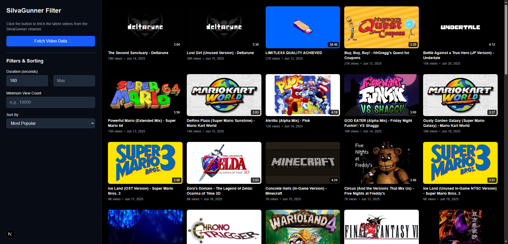

# SiIvaGunner Video Filter

This is a full-stack web application built with Next.js that allows users to browse, filter, and sort videos from the SiIvaGunner YouTube channel. It uses Next.js API routes to securely interact with the YouTube Data API, providing a responsive and interactive interface for exploring the channel's content.



## Features

-   **Browse Videos**: Fetches and displays videos from the SiIvaGunner channel in a clean, grid-based UI.
-   **Server-Side API Key**: Protects the YouTube API key by handling all API requests through a Next.js backend route.
-   **Filtering**:
    -   Filter by video duration (minimum and maximum seconds).
    -   Filter by a minimum number of views.
-   **Sorting**:
    -   Sort by newest or oldest publish date.
    -   Sort by popularity (most views).
-   **Infinite Scrolling**: Seamlessly load more videos by clicking the "Load More" button at the bottom of the page.

## Tech Stack

-   **Framework**: [Next.js](https://nextjs.org/)
-   **Language**: [TypeScript](https://www.typescriptlang.org/)
-   **Styling**: [Tailwind CSS](https://tailwindcss.com/)
-   **API**: [YouTube Data API v3](https://developers.google.com/youtube/v3)

## Motivation

SiIlvaGunner is known for their amazing rips, but sometimes I just want to weave through the endless uploads to see which ones I personally like with ease. Although a bit limited, this project aims to create an interface that I could easily do that. May possibly publish this into a website, but those are plans for the future.

## Getting Started

To run this project locally, you will need a YouTube Data API key.

### 1. Clone the repository

```bash
git clone https://github.com/your-username/silvagunner-filter.git
cd silvagunner-filter
```

### 2. Install dependencies

```bash
npm install
# or
yarn install
# or
pnpm install
```

### 3. Set up environment variables

Create a file named `.env.local` in the root of the project and add your YouTube API key:

```
YOUTUBE_API_KEY="YOUR_API_KEY_HERE"
```

### 4. Run the development server

```bash
npm run dev
# or
yarn dev
# or
pnpm dev
```

Open [http://localhost:3000](http://localhost:3000) with your browser to see the result.